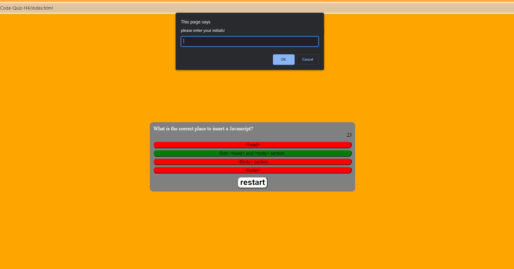

Code-Quiz-H4
=============

Purpose of the site!
=============
This is a website that display's a quiz. Once that quiz is started you will be presented with 3 codeing questions. Whether you are write or wrong you will see the correct answer in green and all others in red.
It does track your score but it only display's in the console if you console.log(score). You will also be asked for your initials but it is quite broken here as it does not clear the prompt.

Description of experience while building this site.
=============

I struggled quite a bit with javaScript so far so its no surprise this was the hardest assignment yet. I did my best and found the html and css to be very easy, as well as some things in javaScript. First I started
with a very generic html and then applied some css styles. I made class's to hide certain things when certain buttons are pressed. Then in javaScript I just starting with laying out functions that made sense first.
like the start quiz button and the timer interval. I decided to try and shuffle the questions which I was succsessful with although I kind of got lost in my code at this point and think it's the main part of why I 
ran into issues later. I could not find out how to stop the prompt for asking for initials. which stopped from locally storing the score and initials. I got the html linked and if you type your initials it goes to load next html but the prompt interupts it. If you cancel 3 times it will load next html but it is blank. 

[link-to-deployed-website](https://skruphold.github.io/Code-Quiz_H4/)